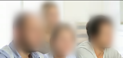
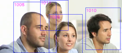

# Find and redact (blur) faces with the Face Detector preset

[!INCLUDE [media services api v3 logo](./includes/v3-hr.md)]

Azure Media Services v3 API includes a Face Detector preset that offers scalable face detection and redaction (blurring) in the cloud. Face redaction enables you to modify your video in order to blur faces of selected individuals. You may want to use the face redaction service in public safety and news media scenarios. A few minutes of footage that contains multiple faces can take hours to redact manually, but with this preset the face redaction process will require just a few simple steps.

This article gives details about **Face Detector Preset** and shows how to use it with Azure Media Services SDK for .NET.

## Compliance, privacy, and security

As an important reminder, you must comply with all applicable laws in your use of analytics in Azure Media Services. You must not use Azure Media Services or any other Azure service in a manner that violates the rights of others. Before uploading any videos, including any biometric data, to the Azure Media Services service for processing and storage, you must have all the proper rights, including all appropriate consents, from the individuals in the video. To learn about compliance, privacy and security in Azure Media Services, the Azure [Cognitive Services Terms](https://azure.microsoft.com/support/legal/cognitive-services-compliance-and-privacy/). For Microsoft’s privacy obligations and handling of your data, review Microsoft’s [Privacy Statement](https://privacy.microsoft.com/PrivacyStatement), the [Online Services Terms](https://www.microsoft.com/licensing/product-licensing/products) (OST) and [Data Processing Addendum](https://www.microsoftvolumelicensing.com/DocumentSearch.aspx?Mode=3&DocumentTypeId=67) (“DPA”). More privacy information, including on data retention, deletion/destruction, is available in the OST and [here](https://docs.microsoft.com/azure/azure-video-analyzer/video-analyzer-for-media-docs/video-analyzer-for-media-docs/faq.yml). By using Azure Media Services, you agree to be bound by the Cognitive Services Terms, the OST, DPA, and the Privacy Statement

## Face redaction modes

Facial redaction works by detecting faces in every frame of video and tracking the face object both forwards and backwards in time, so that the same individual can be blurred from other angles as well. The automated redaction process is complex and does not always  blur every face 100% guaranteed. For this reason, the preset can be used a two-pass mode to improve the quality and accuracy of the blurring through an editing stage prior to submitting the file for the final blur pass. 

In addition to a fully automatic **Combined** mode, the two-pass workflow allows you the ability to choose the faces you wish to blur (or not blur) via a list of face IDs. To make arbitrary per frame adjustments the preset uses a metadata file in JSON format as input to the second pass. This workflow is split into **Analyze** and **Redact** modes.

You can also easily just combine the two modes in a single pass that runs both tasks in one job; this mode is called **Combined**.  In this article, the sample code will show how to use the simplified single pass **Combined** mode on a sample source file.

### Combined mode

This produces a redacted MP4 video file in a single pass without any manual editing of the JSON file required. The output in the asset folder for the job will be a single .mp4 file that contains blurred faces using the selected blur effect. Use the resolution property set to **SourceResolution** to achieve the best results for redaction.

| Stage | File Name | Notes |
| --- | --- | --- |
| Input asset |"ignite-sample.mp4" |Video in WMV, MOV, or MP4 format |
| Preset config |Face Detector configuration | **mode**: FaceRedactorMode.Combined,  **blurType**: BlurType.Med, **resolution**: AnalysisResolution.SourceResolution |
| Output asset |"ignite-redacted.mp4 |Video with blurring effect applied to faces |

### Analyze mode

The **Analyze** pass of the two-pass workflow takes a video input and produces a JSON file with a list of the face locations, Face ID's and jpg images of each detected face.
Be advised that the face id's are not guaranteed to be identical on subsequent runs of the analysis pass.

| Stage | File Name | Notes |
| --- | --- | --- |
| Input asset |"ignite-sample.mp4" |Video in WMV, MPV, or MP4 format |
| Preset config |Face Detector configuration |**mode**: FaceRedactorMode.Analyze, **resolution**: AnalysisResolution.SourceResolution|
| Output asset |ignite-sample_annotations.json |Annotation data of face locations in JSON format. Face id's are not guaranteed to be identical on subsequent runs of the analysis pass. This can be edited by the user to modify the blurring bounding boxes. See sample below. |
| Output asset |foo_thumb%06d.jpg [foo_thumb000001.jpg, foo_thumb000002.jpg] |A cropped jpg of each detected face, where the number indicates the labelId of the face |

#### Output example

```json
{
  "version": 1,
  "timescale": 24000,
  "offset": 0,
  "framerate": 23.976,
  "width": 1280,
  "height": 720,
  "fragments": [
    {
      "start": 0,
      "duration": 48048,
      "interval": 1001,
      "events": [
        [],
        [],
        [],
        [],
        [],
        [],
        [],
        [],
        [],
        [],
        [],
        [],
        [],
        [
          {
            "index": 13,
            "id": 1138,
            "x": 0.29537,
            "y": -0.18987,
            "width": 0.36239,
            "height": 0.80335
          },
          {
            "index": 13,
            "id": 2028,
            "x": 0.60427,
            "y": 0.16098,
            "width": 0.26958,
            "height": 0.57943
          }
        ],

    ... truncated
```

### Redact (blur) mode

The second pass of the workflow takes a larger number of inputs that must be combined into a single asset.

This includes a list of IDs to blur, the original video, and the annotations JSON. This mode uses the annotations to apply blurring on the input video.

The output from the Analyze pass does not include the original video. The video needs to be uploaded into the input asset for the Redact mode task and selected as the primary file.

| Stage | File Name | Notes |
| --- | --- | --- |
| Input asset |"ignite-sample.mp4" |Video in WMV, MPV, or MP4 format. Same video as in step 1. |
| Input asset |"ignite-sample_annotations.json" |Annotations metadata file from phase one, with optional modifications if you wish to change the faces blurred. This must be edited in an external application, code, or text editor. |
| Input asset | "ignite-sample_IDList.txt" (Optional) | Optional new line separated list of face IDs to redact. If left blank, all faces in the source will have blur applied. You can use the list to selectively choose not to blur specific faces. |
| Face Detector preset  |Preset configuration  | **mode**: FaceRedactorMode.Redact, **blurType**: BlurType.Med |
| Output asset |"ignite-sample-redacted.mp4" |Video with blurring applied based on annotations |

#### Example output

This is the output from an IDList with one ID selected.
The face id's are not guaranteed to be identical on subsequent runs of the analysis pass.

Example foo_IDList.txt

```
1
2
3
```

## Blur types

In the **Combined** or **Redact** mode, there are five different blur modes you can choose from via the JSON input configuration: **Low**, **Med**, **High**, **Box**, and **Black**. By default **Med** is used.

You can find samples of the blur types below.

#### Low


#### Med



#### High


#### Box



#### Black


## Elements of the output JSON file

The Redaction MP provides high precision face location detection and tracking that can detect up to 64 human faces in a video frame. Frontal faces provide the best results, while side faces and small faces (less than or equal to 24x24 pixels) are challenging.

[!INCLUDE [media-services-analytics-output-json](./includes/media-services-analytics-output-json.md)]

## .NET sample code

The following program shows how to use the **Combined** single-pass redaction mode:

- Create an asset and upload a media file into the asset.
- Configure the Face Detector preset that uses the mode and blurType settings.
- Create a new Transform using the Face Detector preset
- Download the output redacted video file.

## Download and configure the sample

Clone a GitHub repository that contains the .NET sample to your machine using the following command:  

 ```bash
 git clone https://github.com/Azure-Samples/media-services-v3-dotnet.git
 ```

The sample is located in the [FaceRedactor](https://github.com/Azure-Samples/media-services-v3-dotnet/tree/main/VideoAnalytics/FaceRedactor) folder. Open [appsettings.json](https://github.com/Azure-Samples/media-services-v3-dotnet/blob/main/VideoAnalytics/FaceRedactor/appsettings.json) in your downloaded project. Replace the values with the credentials you got from [accessing APIs](./access-api-howto.md).

**Optionally** you can copy the **[sample.env](https://github.com/Azure-Samples/media-services-v3-dotnet/blob/main/sample.env)** file at the root of the repository and fill out the details in there, and rename that file to **.env** (Note the dot on the front!) so that it can be used across all sample projects in the repository.  This eliminates the need to have a populated appsettings.json file in each sample, and also protects you from checking any settings into your own GitHub cloned repositories.

#### Examples

This code shows how to set up the **FaceDetectorPreset** for a **Combined** mode blur.

[!code-csharp[Main](~/../media-services-v3-dotnet/VideoAnalytics/FaceRedactor/Program.cs#FaceDetectorPreset)]

This code sample shows how the preset is passed into a Transform object during creation. After creating the Transform, jobs may be submitted directly to it.

[!code-csharp[Main](~/../media-services-v3-dotnet/VideoAnalytics/FaceRedactor/Program.cs#FaceDetectorPresetTransform)]
