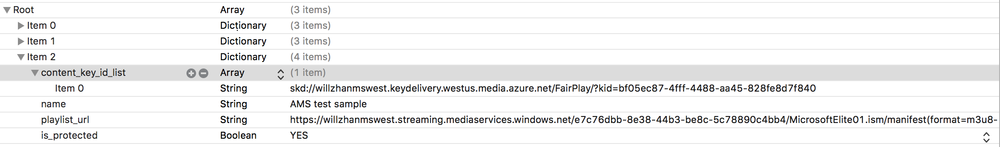

<!-- William Zhang -->

# Offline FairPlay Streaming for iOS with Media Services v3

[!INCLUDE [media services api v3 logo](./includes/v3-hr.md)]

 Azure Media Services provides a set of well-designed [content protection services](https://azure.microsoft.com/services/media-services/content-protection/) that cover:

- Microsoft PlayReady
- Google Widevine

    Widevine is a service provided by Google Inc. and subject to the terms of service and Privacy Policy of Google, Inc.
- Apple FairPlay Streaming - An Apple DRM technology that is only available for video transferred over HTTP Live Streaming (HLS) on iOS devices, in Apple TV, and in Safari on macOS.
- AES-128 encryption

Digital rights management (DRM)/Advanced Encryption Standard (AES) encryption of content is performed dynamically upon request for various streaming protocols. DRM license/AES decryption key delivery services also are provided by Media Services.

Besides protecting content for online streaming over various streaming protocols, offline mode for protected content is also an often-requested feature. Offline-mode support is needed for the following scenarios:

* Playback when internet connection isn't available, such as during travel.
* Some content providers might disallow DRM license delivery beyond a country/region's border. If users want to watch content while traveling outside of the country/region, offline download is needed.
* In some countries/regions, internet availability and/or bandwidth is still limited. Users might choose to download first to be able to watch content in a resolution that is high enough for a satisfactory viewing experience. In this case, the issue typically isn't network availability but limited network bandwidth. Over-the-top (OTT)/online video platform (OVP) providers request offline-mode support.

This article covers FairPlay Streaming (FPS) offline-mode support that targets devices running iOS 10 or later. FairPlay Streaming is an Apple technology that is only available for video transferred over HTTP Live Streaming (HLS) on iOS devices, in Apple TV, and in Safari on macOS.

> [!NOTE]
> Offline DRM is only billed for making a single request for a license when you download the content. Any errors are not billed.

## Prerequisites

Before you implement offline DRM for FairPlay on an iOS 10+ device:

* Review online content protection for FairPlay:

    - [Apple FairPlay license requirements and configuration](drm-fairplay-license-overview.md)
    - A .NET sample that includes configuration of online FPS streaming: [ConfigureFairPlayPolicyOptions](https://github.com/Azure-Samples/media-services-v3-dotnet-tutorials/blob/main/AMSV3Tutorials/EncryptWithDRM/Program.cs#L493)
* Obtain the FPS SDK from the Apple Developer Network. The FPS SDK contains two components:

    - The FPS Server SDK, which contains the Key Security Module (KSM), client samples, a specification, and a set of test vectors.
    - The FPS Deployment Pack, which contains the D function specification, along with instructions about how to generate the FPS Certificate, customer-specific private key, and Application Secret Key. Apple issues the FPS Deployment Pack only to licensed content providers.
    - The .der/.cer certificate files you receive as part of the generation of the FPS certificate contain a public key and can be made available to the client.  The private key (.pfx) should be secured in Azure Key Vault or another secure location.
* Clone https://github.com/Azure-Samples/media-services-v3-dotnet-tutorials.git.

    - Modify the code in [Encrypt with DRM using .NET](https://github.com/Azure-Samples/media-services-v3-dotnet-tutorials/tree/main/AMSV3Tutorials/EncryptWithDRM) to add FairPlay configurations.

For the final integrated test, both the video URL and the application certificate URL are provided in the section "Integrated Test."

In HLSCatalog\Shared\Resources\Streams.plist, add your test video URL. For the content key ID, use the FairPlay license acquisition URL with the skd protocol as the unique value.

Use your own test video URL, FairPlay license acquisition URL, and application certificate URL, if you have them set up. Or you can continue to the next section, which contains test samples.

## Integrated test

Three test samples in Media Services cover the following three scenarios:

* FPS protected, with video, audio, and alternate audio track
* FPS protected, with video and audio, but no alternate audio track
* FPS protected, with video only and no audio

You can find these samples at [this demo site](https://aka.ms/poc#22), with the corresponding application certificate hosted in an Azure web app.
With either the version 3 or version 4 sample of the FPS Server SDK, if a master playlist contains alternate audio, during offline mode it plays audio only. Therefore, you need to strip the alternate audio. In other words, the second and third samples listed previously work in online and offline mode. The sample listed first plays audio only during offline mode, while online streaming works properly.

---

## Offline Fairplay questions

See [offline fairplay questions in the FAQ](frequently-asked-questions.yml).

[!INCLUDE [Store FairPlay Private Key in Azure KeyVault](./includes/task-drm-store-fairplay-key.md)]
