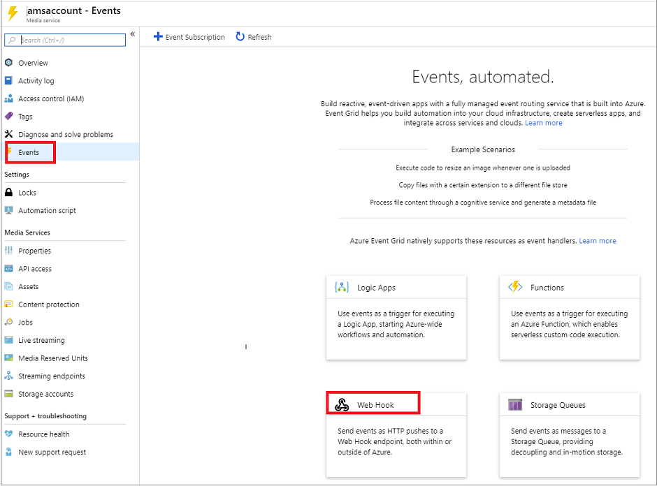
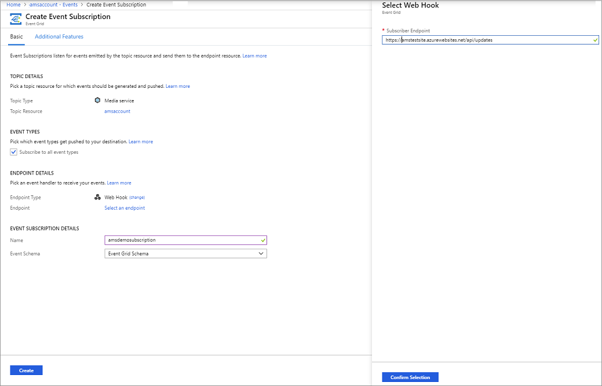

# Create and monitor Media Services events with Event Grid using the Azure portal

[!INCLUDE [media services api v3 logo](../includes/v3-hr.md)]

Azure Event Grid is an eventing service for the cloud. This service uses [event subscriptions](https://docs.microsoft.com/event-grid/concepts.md#event-subscriptions) to route event messages to subscribers. Media Services events contain all the information you need to respond to changes in your data. You can identify a  Media Services event because the eventType property starts with "Microsoft.Media.". For more information, see [Media Services event schemas](media-services-event-schemas.md).

In this article, you use the Azure portal to subscribe to events for your Azure Media Services account. Then, you trigger events to view the result. Typically, you send events to an endpoint that processes the event data and takes actions. In the article, we send events to a web app that collects and displays the messages.

When you're finished, you see that the event data has been sent to the web app.

## Prerequisites 

* Have an active Azure subscription.
* Create a new Azure Media Services account, as described in [this quickstart](../account-create-how-to.md).

## Create a message endpoint

Before subscribing to the events for the Media Services account, let's create the endpoint for the event message. Typically, the endpoint takes actions based on the event data. In this article, you deploy a [pre-built web app](https://github.com/Azure-Samples/azure-event-grid-viewer) that displays the event messages. The deployed solution includes an App Service plan, an App Service web app, and source code from GitHub.

1. Select **Deploy to Azure** to deploy the solution to your subscription. In the Azure portal, provide values for the parameters.

   

1. The deployment may take a few minutes to complete. After the deployment has succeeded, view your web app to make sure it's running. In a web browser, navigate to: 
`https://<your-site-name>.azurewebsites.net`

If you switch to the "Azure Event Grid Viewer" site, you see it has no events yet.
   
<!--
[!INCLUDE [event-grid-register-provider-portal.md](../../includes/event-grid-register-provider-portal.md)]
-->

## Subscribe to Media Services events

You subscribe to a topic to tell Event Grid which events you want to track, and where to send the events.

1. In the portal, select your Media Services account and select **Events**.
1. To send events to your viewer app, use a web hook for the endpoint. 

   

1. The event subscription is prefilled with values for your Media Services account. 
1. Select 'Web Hook' for the **Endpoint Type**.
1. In this topic, we leave the **Subscribe to all event types** checked. However, you can uncheck it and filter for specific event types. 
1. Click on the **Select an endpoint** link.

    For the web hook endpoint, provide the URL of your web app and add `api/updates` to the home page URL. 

1. Press **Confirm Selection**.
1. Press **Create**.
1. Give your subscription a name.

   

1. View your web app again, and notice that a subscription validation event has been sent to it. 

    Event Grid sends the validation event so the endpoint can verify that it wants to receive event data. The endpoint has to set `validationResponse` to `validationCode`. For more information, see [Event Grid security and authentication](https://docs.microsoft.com/event-grid/security-authentication.md). You can view the web app code to see how it validates the subscription.

Now, let's trigger events to see how Event Grid distributes the message to your endpoint.

## Send an event to your endpoint

You can trigger events for the Media Services account by running an encoding job. You can follow [this quickstart](../stream-files-dotnet-quickstart.md) to encode a file and start sending events. If you subscribed to all events, you will see a screen similar to the following:

> [!TIP]
> Select the eye icon to expand the event data. Do not refresh the page, if you want to view all the events.

