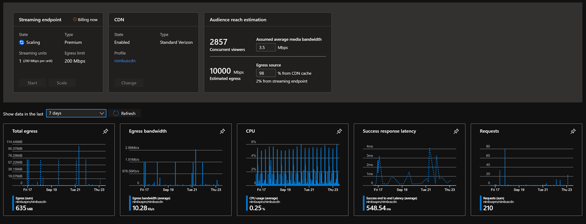
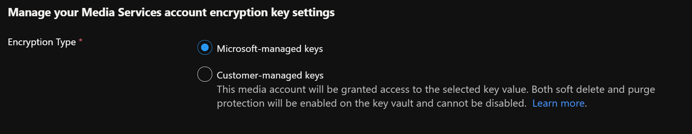

# Azure Media Services v3 release notes

[!INCLUDE [media services api v3 logo](./includes/v3-hr.md)]

To stay up to date with the most recent developments, this article provides you with information about:

* The latest releases
* Known issues
* Bug fixes
* Deprecated functionality

## December 2022

Media Services now supports IPv6 for streaming media to live events, streaming content from streaming endpoints, and when delivering content keys. To enable IPv6 for streaming endpoints and live events, the IP allow list for the resource must include at least one IPv6 address or IPv6 range. When CDN support is enabled for a streaming endpoint, IPv6 support is dependent on the CDN configuration.

For more information about using IPv6 with Media Services, see [Media Services live events](live-event-concept.md) and [Restrict access to DRM license and AES key delivery using IP allowlists](drm-content-protection-key-delivery-ip-allow.md).

## November 2022

Media Services now removes the audio rendition from HLS Variant Playlist by default to prevent the client from falling back to audio only under a poor network situation.

In order to change the behavior, you can use the URL tag `[audio-only=true]` to write an audio rendition in HLS Variant Playlist.

For example:

`http://host/locator/asset.ism/manifest(format=m3u8-aapl,audio-only=true)`

This was due to a change in the HLS authoring guidelines that now state "You MUST have no audio-only variants listed in the Multivariant playlist".

## September 2022

### API Release: Updated 2022-08-01 ARM REST API

An updated version of the ARM REST API for Azure Media Services has been released. Version 2022-08-01 is now the latest stable release in production.  The latest REST API definitions are available in the [REST specification folder for Media Services on GitHub.](https://github.com/Azure/azure-rest-api-specs/tree/master/specification/mediaservices/resource-manager/Microsoft.Media/stable/2020-05-01)

Updates to the 2022-08-01 API include:

- The **LiveOutput** entity introduces a new nullable property **rewindWindowLength** to control seek-able window length during Live for encoding and pass through Live events. This property is not used once LiveOutput stops. The archived VOD will have full content with original **archiveWindowLength**. When the property is set to null, a low-latency (LowLatencyV2) live event uses the default value of 30 minutes; a standard live event does not use it.
- Added support for PlayReady SL3000 security level in Content Key Policies
- Extended asset tracks API to support audio tracks (for late-binding descriptive audio or multiple languages)
- Added support for MPEG Common Encryption Clear Key with 'cenc' and 'cbcs' modes in Streaming Policies

Many code samples are available in .NET, JavaScript (Node.js), Python, Java in our [Samples GitHub repositories](samples-overview.md)

### New SDK client versions available for Javascript, Python, Go

- New Python client SDK v10.1.0 is available on PyPI: [azure-mgmt-media](https://pypi.org/project/azure-mgmt-media/10.1.0/)

- New Javascript client SDK v13 is available on npm: [Azure Media client library for JavaScript - @azure/arm-mediaservices](https://www.npmjs.com/package/@azure/arm-mediaservices/v/13.0.0)

- New GO client SDK v 3.1.0 is available - [armmediaservices package](https://pkg.go.dev/github.com/Azure/azure-sdk-for-go/sdk/resourcemanager/mediaservices/armmediaservices/v3@v3.1.0)


### PlayReady Security Level 3000 license support (SL3000)

The PlayReady DRM content protection and license delivery features of Media Services now supports PlayReady SL3000.  The Security Level is a property of a PlayReady Client, and every license delivered to a client has a property indicating the minimum Security Level required from a client to allow binding to this license. Security Level 3000 is provided for hardened devices with the highest security consuming the highest quality of commercial content. This update allows you to configure Content Key polices to delivery PlayReady SL3000 licenses through the Media Services Key Delivery license servers.
For more details on PlayReady Security levels, see the article [Using the Security Level in a License](/playready/overview/security-level#using-the-security-level-in-a-license).

- If you add an SL3000 PlayReady **ContentKeyPolicyOption** to a Content Key Policy, that policy can only contain additional PlayReady SL3000 or Widevine L1 options.
- SL3000 requires that you use a different key for audio or use unencrypted audio. The audio security level should be limited to SL2000 or lower.
- SL3000 playback does not work in Azure Media Player (AMP) at this time. Please test in a 3rd party player (e.g. Shaka Player) or device that supports SL3000 playback.

**Example Content Key Policy**:

```json
{
    "properties": {
        "options": [
            {
                "name": "PlayReadyOption",
                "configuration": {
                    "@odata.type": "#Microsoft.Media.ContentKeyPolicyPlayReadyConfiguration",
                    "licenses": [
                        {
                            "playRight": {
                                "digitalVideoOnlyContentRestriction": false,
                                "imageConstraintForAnalogComponentVideoRestriction": false,
                                "imageConstraintForAnalogComputerMonitorRestriction": false,
                                "allowPassingVideoContentToUnknownOutput": "NotAllowed"
                            },
                            "licenseType": "NonPersistent",
                            "contentKeyLocation": {
                                "@odata.type": "#Microsoft.Media.ContentKeyPolicyPlayReadyContentEncryptionKeyFromHeader"
                            },
                            "contentType": "Unspecified",
                            "securityLevel": "SL3000"
                        }
                    ]
                },
                "restriction": {
                    "@odata.type": "#Microsoft.Media.ContentKeyPolicyOpenRestriction"
                }
            }
        ]
    }
}
```

**Example Streaming Policy using an SL3000 Content Key Policy for Video, and SL2000 Content Key Policy for audio tracks:
**

```json
{
    "properties": {
        "defaultContentKeyPolicyName": "sl3000_content_key_policy",
        "commonEncryptionCenc": {
            "enabledProtocols": {
                "download": false,
                "dash": true,
                "hls": false,
                "smoothStreaming": true
            },
            "contentKeys": {
                "defaultKey": {
                    "label": "cencDefaultKey"
                },
                "keyToTrackMappings": [
                    {
                        "label": "audiokey",
                        "policyName" : "sl2000_content_key_policy",
                        "tracks": [
                            {
                                "trackSelections": [
                                    {
                                        "property": "FourCC",
                                        "operation": "Equal",
                                        "value": "mp4a"
                                    }
                                ]
                            }
                        ]
                    }
                ]
            },
            "drm": {
                "playReady": {}
            }
        }
    }
}
```

For more details on using PlayReady license templates see the article [Media Services PlayReady license templates](drm-playready-license-template-concept.md)


### Add audio tracks for descriptive audio or multiple languages with the new Asset Tracks API

The new Asset Tracks API allows you to late-bind any number of audio tracks to an existing asset and make them available for dynamic packaging to HLS and DASH.  The API supports setting metadata to specify the language or content characteristics to specify "descriptive audio" for improved content accessibility.

For the full list of capabilities on the Tracks API, see the article [Media Services Tracks API](tracks-concept.md)

Many code samples are available in .NET, JavaScript (Node.js), Python, Java in our [Samples GitHub repositories](samples-overview.md)

### Support for MPEG Common Encryption Clear Key with CENC and CBCS encryption

Clear Key encryption is a feature of the [MPEG Common Encryption (CENC) standard](https://www.iso.org/standard/68042.html) and is supported by the HTML5 Encrypted Media Extensions (EME) available in many modern browsers. Clear Key AES-128 encryption using 'cenc' or 'cbcs' encryption modes can be set in your Streaming policies to allow you to reach the widest range of devices across Apple, Web and Android.

This feature allows you to support the Common Encryption standard without the use of a DRM system, and reach the widest range of players. With the support for Clear Key encryption using 'cenc' or 'cbcs' encryption modes, you can now distribute secure content without DRM to players that support either mode of encryption allowed in the standard. This allows you to deliver encrypted content to client players such as Google Shaka player (v 4.0.0+), Dash.js (v 4.5+), Bitmovin, Theo Player, and Android ExoPlayer (v 2.18.1+) using 'cenc' encryption.

For more details on using the content protection features of Media Services see the article [Content protection with dynamic encryption and key delivery](drm-content-protection-concept.md)

### Rewind Window vs Archive Window on Live Outputs

The **rewindWindowLength** can be set on Live Outputs to control the seek-able window on the client player during live streaming. This helps customer to control how much time is visible in the player for seeking back into the live stream.
This setting also helps to reduce the manifest size delivered to the client over the network during live streaming, which may end up with more efficient live streaming experience and reduce memory usage on the client.

After your stream is complete, you can access the archived file in the asset defined by the **archiveWindowLength** property on the Live Output. This allows you to now set a different archive duration from the previous "DVR sliding window" duration that is visible to the player.
This is very useful for when you want to stream with a very small time-shifting window in the player, but wish to archive the entire live event to the output asset.

You can set **rewindWindowLength** to a minimum value of 60 seconds. The default value is 30 minutes if you enable a live event with the "LowLatencyV2" option, otherwise, there is no default value. If the **rewindWindowLength** is not set, and the live event is not set to use "LowLatencyV2" option, no default value is set by the server and the seekable window during the live playback would be the same value as the **archiveWindowLength**.  In this situation, if the **archiveWindowLength** is set to a very large duration, the player could be impacted by more buffering issues during playback in the live mode because of the larger manifest size download to the player for parsing.

For more details see the article [Use time-shifting and Live Outputs to create on-demand video playback](live-event-cloud-dvr-time-how-to.md)

Many code samples are available in .NET, JavaScript (Node.js), Python, Java in our [Samples GitHub repositories](samples-overview.md)

### New Region: China North 3 is now GA

Customers in China can now access Azure Media Services in the China North 3 region, in addition to the existing 4 regions that are GA already (China East, China East 2, China North, China North 2). See the [region availability by feature table](azure-clouds-regions.md#china) for detailed information.

### Retirement of the Azure Media Redactor, Video Analyzer, and Face Detector on September 14, 2023

As Microsoft’s [Responsible AI Standards](https://blogs.microsoft.com/on-the-issues/2022/06/21/microsofts-framework-for-building-ai-systems-responsibly) outline, Microsoft is committed to fairness, privacy, security, and transparency with respect to AI systems. To better align our products to this new Standard and the [Limited Access policy](https://aka.ms/AAh91ff) for other Microsoft products, Azure Media Services will be retiring the following capabilities on September 14, 2023:

* Azure Media Redactor (RESTv2)
* Face Detector preset
* Video Analyzer preset

After **September 14, 2023**, any applications you have developed using the Azure Media Redactor, the Face Detector preset, or the Video Analyzer preset will begin experience errors or failed job submissions.

**Action Required**

The Azure Media Redactor (RESTv2) and the Face Detector preset will be retired and are not being replaced at this time. If you would like to instead detect people in a video, we recommend you update your applications to use the Video Indexer APIs for [detecting observed people](/azure/azure-video-indexer/observed-people-tracing) and [matching observed people](/azure/azure-video-indexer/matched-person) to faces and [submit a request to get access to the Limited Access program](https://aka.ms/facerecognition) for these features.

If you are currently using the Video Analyzer preset, we recommend updating your applications to use the Video Indexer APIs for video analysis, which offers an extended range of capabilities.

**More information**

If you have questions, get answers from community experts in [Microsoft Q&A](/answers/topics/azure-media-services.html). If you have a support plan and you need technical help, please create a [support request](https://portal.azure.com/#blade/Microsoft_Azure_Support/HelpAndSupportBlade/newsupportrequest) in the Azure portal.


## August 2022

### New Azure Media Services marketing page with live low latency demonstration

A new Azure Media Services marketing page with a live demonstration of LL-HLS is available now at [https://media.microsoft.com](https://media.microsoft.com).  This page will be updated with more links to samples, demonstrations and quick starts over time.
Please bookmark the page as a reference page to easily jump to docs, samples, and login to your account in the Azure Portal.

### New Tracks API sample in Node.js/Typescript for adding Subtitle and Caption tracks to any asset

A new sample demonstrating how to late-bind a WebVTT or TTML subtitle or caption file is now available in the Node.js sample project. See the sample [Add a WebVTT/IMSC1/TTML subtitle or caption to an existing asset](https://github.com/Azure-Samples/media-services-v3-node-tutorials/blob/main/Assets/add-WebVTT-tracks.ts)

This sample shows how you can add any number of text tracks to an asset and have them packaged as TTML/IMSC1 text profile in both DASH and HLS.  The API also allows you to set specific characteristics of the HLS manifest, such as the Default caption track, set the "Forced" property, as well as control the "Characteristics" value of the HLS text track per the Apple HLS specification.

The API currently supports uploading .vtt or .ttml file format to an existing asset. New tracks that are registered with the tracks API will show up immediately in the DASH and HLS manifest as IMSC1 profile MP4 text tracks.

Many code samples are available in .NET, JavaScript (Node.js), Python, Java in our [Samples GitHub repositories](samples-overview.md)

## June 2022

### Custom audio bitrates supported in custom live encoding presets

You can now request a custom live encoding preset that supports multiple audio bitrate outputs.
For audio in a live preset you can now customize with the following discrete AAC audio bitrates (96k, 112k, 128k, 160k, 192k, 224k, 256k, 320k, 384k, 448k, 512k). Also please specify that you are requesting a *custom* preset in the support ticket.

Custom presets can now contain multiple discrete audio bitrates in the same live encoding preset. This is useful for markets that require a lower bitrate audio track over mobile networks. One example would be a custom live preset that can output both 96k and 128k AAC audio tracks simultaneously.  The player can then filter or select the appropriate track, or a dynamic filter can be applied to offer a 96k only manifest or a 128k only manifest during publishing of a streaming locator (or switched on-the-fly using the 'filter={filterName}' query parameter on the streaming locator URL).

### Autoscaling

You can now autoscale the premium streaming endpoints in your Media
Services account based on any available metrics for the streaming endpoint, or
metrics for any related entities. A combination of these metrics can be used to
create the rule for autoscaling. For more information see [Autoscale Media Services streaming endpoints](streaming-endpoint-autoscaling-how-to.md).
Note that autoscaling can still take time, and is not instantaneous, so be sure to allow enough time for resources to scale and deploy in your architecture designs.  Streaming endpoints take time to spin up, so it is recommended to use lower value trigger points for CPU utilization and network bandwidth egress to trigger a scale-up.

## May 2022

### Closed captioning 708 and 608 HLS manifest decoration support

Live streams that are ingested with embedded 608/708 captions in the elementary stream are now properly attributed in the HLS manifest using the EXT-X-MEDIA tag with a TYPE=CLOSED-CAPTIONS.
This is in compliance with [RFC-8216 section 4.3.4.1](https://www.rfc-editor.org/rfc/rfc8216).

For example, a live stream with 608 and 708 closed captions would show up in the HLS manifest:

```
   #EXT-X-MEDIA:TYPE=CLOSED-CAPTIONS,GROUP-ID="cc",NAME="CEA708_CC",DEFAULT=YES,INSTREAM-ID="SERVICE1"
   #EXT-X-MEDIA:TYPE=CLOSED-CAPTIONS,GROUP-ID="cc",NAME="CEA608_CC",INSTREAM-ID="CC1"
```

## April 2022

### Live transcriptions

Live Transcription is now Generally Available (GA) and supports all available languages in the speech-to-text API.  A full list of languages is available in the article [Live transcription regions and languages](live-event-live-transcription-how-to.md)

### Low Latency HLS (LL-HLS)

Low latency HLS (LL-HLS) is now available in the API and in the Azure Portal. To enable LL-HLS, use the "LowLatencyV2" Stream Option when creating a live stream. See the Node.js sample for how to configure [Create a Low latency HLS live encoding event](https://github.com/Azure-Samples/media-services-v3-node-tutorials/blob/main/Live/720P_Low_Latency_Encoding_Live_Event/index.ts)
In the Azure portal select the new "Low Latency" option when creating a live event.  The new LL-HLS feature can provide reduced latency in the 4-7 second range when using a player framework that supports the LL-HLS protocol.
Low latency HLS is only available on live transcoding channels and not yet available for "pass-through" mode live events.

A live demonstration of the LL-HLS delivery to a Shaka player is available at https://media.microsoft.com/live

Code samples are available in .NET, JavaScript (Node.js), Python, Java in our [Samples GitHub repositories](samples-overview.md)

## March 2022

### .NET SDK version 6.0.0

The .NET SDK version 6.0.0 is now available on Nuget.
[Microsoft.Azure.Management.Media](https://www.nuget.org/packages/Microsoft.Azure.Management.Media)

This SDK supports the new [2021-11-01 stable](https://github.com/Azure/azure-rest-api-specs/blob/fb31972c13cf183c43414d2b4736a5d70aa8af68/specification/mediaservices/resource-manager/Microsoft.Media/stable/2021-11-01/) version of the AMS REST OpenAPI specification.

To install using the Package Manager:

```
Install-Package Microsoft.Azure.Management.Media -Version 6.0.0
```

To install using .NET CLI

```dotnetcli
dotnet add package Microsoft.Azure.Management.Media --version 6.0.0
```

Changes in the 6.0.0 SDK include:

* Added new tracks API under asset to manage the tracks available in the asset.
* Added Main10 Encoding Profile for H265 encoding.
* Exposed RateControlMode for H264 encoding, enabling 2 new rate-control modes - CBR (Constant Bit Rate) and CRF (Constant Rate Factor).
* Added "skus" property to streaming endpoint to indicate the type of streaming endpoint and its scale. This allows configuration of manual or auto scaling of streaming units in a streaming endpoint.
* Added "LowLatencyV2" stream option on the live event to be used for low latency live streaming using Apple's Low Latency HLS format (LL-HLS)

### New Docs content: Stream a Microsoft Teams Meeting

It's easy to relay your meeting broadcast from Microsoft Teams with a Media Services live event. Easily place your live Teams meeting on a public website, or use DRM to protect your stream. Capture and record the stream as a VOD asset for use with the Media Services encoding platform.  See [Stream a Microsoft Teams Meeting](stream-with-teams-how-to.md).

### Late-bind captions and subtitle tracks on assets with the new Tracks API

A new tracks API on assets allows you to list available tracks inside of an asset.  This allows you to discover the available audio, video, and text tracks stored in an asset.
The tracks API allows you to late-bind caption and subtitle files in IMSC1 text profile and WebVTT format to your streaming assets.  In the past, customers needed to modify the .ism file in the blob storage account to add new late-bound tracks to their assets. This replaces that manual task and provides a supported SDK route to enable the addition of late-bound subtitle and caption files.

For technical details on the new track API, see the [2021-11-01 version of the AMS REST OpenAPI specification here](https://github.com/Azure/azure-rest-api-specs/blob/fb31972c13cf183c43414d2b4736a5d70aa8af68/specification/mediaservices/resource-manager/Microsoft.Media/stable/2021-11-01/AssetsAndAssetFilters.json#L1427).

A basic list tracks sample is provide in Javascript [each](https://github.com/Azure-Samples/media-services-v3-node-tutorials/blob/main/Assets/list-tracks-in-asset.ts)
Additional samples and documentation will be provided for each SDK soon.

Code samples are available in .NET, JavaScript (Node.js), Python, Java in our [Samples GitHub repositories](samples-overview.md)

## December 2021

### Updated JavaScript SDK version 10.0.0

The JavaScript SDK is now updated to support the latest REST API release of 2021-06-01. This new isomorphic JavaScript SDK includes better support for Promises and the ability to authenticate using the @azure/identity library for use with Azure AD applications, managed identity, and more.

To download the latest package, see the [@azure/arm-media-services NPM package](https://www.npmjs.com/package/@azure/arm-mediaservices).

An updated and expanded set of Node.js and TypeScript based samples for the new JavaScript package is available in Git Hub.
[https://github.com/Azure-Samples/media-services-v3-node-tutorials](https://github.com/Azure-Samples/media-services-v3-node-tutorials)

### Hebrew, Persian, and Portugal Portuguese languages available in the Audio/Video Analyzer preset for transcriptions

Hebrew, Persian, and Portugal Portuguese (the current model that exists today is Brazilian Portuguese) are now available for use in the [Audio and Video Analyzer preset](./analyze-video-audio-files-concept.md)

The new supported BCP-47 language codes are: he-IL, fa-IR, and pt-PT.

### New Region: Sweden Central region is now GA

 Media Services is now generally available in the Sweden Central region. There are currently some feature limitations in the region while we await a few dependency services to also arrive in the region. Check the [regional feature availability chart](./azure-clouds-regions.md) to determine when features will arrive.

### New live event channel archive heartbeat event

A new event that tracks the status and health of the live event archive has been added. See the LiveEventChannelArchiveHeartbeatEvent in the [Event Grid schemas for Media Services](./monitoring/media-services-event-schemas.md) for more details on this new event.


## September 2021

### New basic pass-through live event SKU

The new basic pass-through live event SKU allows customers to create live events at a [lower price point](https://azure.microsoft.com/pricing/details/media-services/). It is similar to standard pass-through live events, but with lower input bandwidth limits, fewer live outputs allowed, different DVR window length limits, and no access to live transcription. See [live event types comparison](./live-event-types-comparison-reference.md#types-comparison) for more details.

### Improved scale management and monitoring for a Streaming Endpoint in the portal

The streaming endpoint portal page now provides an easy way for you to manage your egress capacity and estimate your audience  reach with and without a CDN configured.  Adjust the delivery bitrate and expected CDN cache hit ratio to get quick estimations of your audience size and help you determine if you need to scale up to more Premium streaming endpoints.

   [  ](./media/release-notes/streaming-endpoint-monitor.png#lightbox)

### Streaming Endpoint portal page now shows CPU, egress, and latency metrics

You can now visualize the CPU load, egress bandwidth and end-to-end latency metrics on their streaming endpoints in the Azure portal. You can now create monitoring alerts based on the CPU, egress, or latency metrics directly in the portal using the power of Azure Monitor.

### User-Assigned Managed Identities support for Media Services accounts

Using User-Assigned Managed Identities, customers will now be able to enable better security of their storage accounts and associated key vaults. Access to the customer storage account and key vaults will be limited to the user assigned managed identity.  You have full control over the lifetime of user-managed identities and can easily revoke the media service account’s access to any specific storage account as needed.

### Media services storage accounts page in the portal now support both UAMI and SAMI

You can now assign and manage user-assigned managed identities (UAMI) or system-assigned managed identities(SAMI) for your storage accounts directly in the Azure portal for Media Services.

### Bring your own key page now also supports both UAMI and SAMI.
The key management portal page for Media Services now supports configuration and management of  user-assigned managed identities (UAMI) or system-assigned managed identities (SAMI).

   [ ](./media/release-notes/byok-managed-identity.png)


### Private endpoint support for Media services
You can now restrict public access to your live events, streaming endpoints, and key delivery services endpoint for content protection and DRM by creating a private endpoint for each of the services. This will limit public access to each of these services. Only traffic originating from your configured virtual network (VNET), configured in Private Endpoint, will be able reach these endpoints.

### IP allowlist for Key Service
You can now choose to allow certain public IP addresses to have access to the key delivery service for DRM and content protection. Live event and streaming endpoints already support configuration of IP allowlist in their respective pages.

You also now have an account level feature flag to allow/block public internet access to your media services account.

## July 2021

### .NET SDK (Microsoft.Azure.Management.Media) 5.0.0 release available in NuGet

The [Microsoft.Azure.Management.Media](https://www.nuget.org/packages/Microsoft.Azure.Management.Media/5.0.0) .NET SDK version 5.0.0 is now released on NuGet. This version is generated to work with the [2021-06-01 stable](https://github.com/Azure/azure-rest-api-specs/tree/master/specification/mediaservices/resource-manager/Microsoft.Media/stable/2021-06-01) version of the ARM REST API.

For details on changes from the 4.0.0 release see the [change log](https://github.com/Azure/azure-sdk-for-net/blob/main/sdk/mediaservices/Microsoft.Azure.Management.Media/CHANGELOG.md).

#### Changes in the 5.0.0 .NET SDK release

* The Media Services account now supports system and user assigned managed identities.
* Added **PublicNetworkAccess** option to Media Services accounts. This option can be used with the Private Link feature to only allow access from private networks, blocking all public network access
* Basic passthrough - A new live event type is added. "Basic Pass-through" live events have similar capabilities as standard pass-through live events with some input and output restrictions, and are offered at a reduced price.
* **PresetConfigurations** - allow you to customize the output settings, and min and max bitrates used for the [Content Aware Encoding presets](./encode-content-aware-concept.md). This helps you to better estimate and plan for more accurate billing when using Content Aware Encoding through constrained output track numbers and resolutions.

#### Breaking changes in tht 5.0.0 .NET SDK release

* **ApiErrorException** has been replaced with **ErrorResponseException** to be consistent with all other Azure SDKs. Exception body has not changed.
* All calls returning 404 Not found now raise an **ErrorResponseException** instead of returning null. This change was made to be consistent with other Azure SDKs
* Media service constructor has new optional PublicNetworkAccess parameter after KeyDelivery parameter.
* Type property in **MediaServiceIdentity** has been changed from ManagedIdentityType enum to string to accommodate multiple comma-separated values. Valid strings are **SystemAssigned** or **UserAssigned**.

## June 2021

### More Live Event ingest heartbeat properties for improved diagnostics

More live event ingest heartbeat properties have been added to the Event Grid message. This includes the following new fields to assist with diagnosing issues during live ingest.  The **ingestDriftValue** is helpful in scenarios where you need to monitor network latency from the source ingest encoder pushing into the live event. If this value drifts out too far, it can be an indication that the network latency is too high for a successful live streaming event.

See the [LiveEventIngestHeartbeat schema](./monitoring/media-services-event-schemas.md#liveeventingestheartbeat) for more details.

### Private Link support is now GA

Support for using Media Services with [private links](/azure/private-link/) is now GA and available in all Azure regions including Azure Government clouds.

Azure Private Link enables you to access Azure PaaS Services and Azure hosted customer-owned/partner services over a Private Endpoint in your virtual network.

Traffic between your virtual network and the service traverses over the Microsoft backbone network, eliminating exposure from the public Internet.

For details on how to use Media Services with private endpoints, see [Create a Media Services and Storage account with a private endpoint](security-private-endpoint-concept.md)

### New Region: US West 3 region is GA

The US West 3 region is now GA and available for customers to use when creating new Media Services accounts.

### Key delivery supports IP allowlist restrictions

Media Services accounts can now be configured with IP allowlist restrictions on key delivery. The new allowlist setting is available on the Media Services account resource through the SDK and in the portal and CLI.
This allows operators to restrict delivery of DRM licenses and AES-128 content keys to specific IPv4 ranges.

This feature can also be used to shut off all public internet delivery of DRM licenses or AES-128 keys and restrict delivery to a private network endpoint.

See the article [Restrict access to DRM license and AES key delivery using IP allowlists](./drm-content-protection-key-delivery-ip-allow.md) for details.

### New Samples for Python and Node.js (with TypeScript)
Updated samples for **Node.js** that use the latest TypeScript support in the Azure SDK.

|Sample|Description|
|---|---|
|[Live streaming](https://github.com/Azure-Samples/media-services-v3-node-tutorials/tree/main/Live/)| Basic live streaming example. **WARNING**, make sure to check that all resources are cleaned up and no longer billing in portal when using live|
|[Upload and stream HLS and DASH](https://github.com/Azure-Samples/media-services-v3-node-tutorials/blob/main/Streaming/StreamFilesSample/index.ts)| Basic example for uploading a local file or encoding from a source URL. Sample shows how to use storage SDK to download content, and shows how to stream to a player |
|[Upload and stream HLS and DASH with PlayReady and Widevine DRM](https://github.com/Azure-Samples/media-services-v3-node-tutorials/blob/main/Streaming/StreamFilesWithDRMSample/index.ts)| Demonstrates how to encode and stream using Widevine and PlayReady DRM |

New **Python** sample demonstrating how to use Azure Functions, and Event Grid to trigger Face redaction preset.

## May 2021

### Availability Zones default support in Media Services

Media Services now supports [Availability Zones](concept-availability-zones.md), providing fault-isolated locations within the same Azure region.  Media Services accounts are zone redundant by default now and there is no extra configuration or settings required. This only applies to regions that have [Availability Zones support](/azure/availability-zones/az-region#azure-regions-with-availability-zones)


## March 2021

### New language support added to the AudioAnalyzer preset

More languages for video transcription and subtitling are available now in the AudioAnalyzer preset (both Basic and Standard modes).

* English (Australia), 'en-AU'
* French (Canada), 'fr-CA'
* Arabic (Bahrain) modern standard, 'ar-BH'
* Arabic (Egypt), 'ar-EG'
* Arabic (Iraq), 'ar-IQ'
* Arabic (Israel), 'ar-IL'
* Arabic (Jordan), 'ar-JO'
* Arabic (Kuwait), 'ar-KW'
* Arabic (Lebanon), 'ar-LB'
* Arabic (Oman), 'ar-OM'
* Arabic (Qatar), 'ar-QA'
* Arabic (Saudi Arabia), 'ar-SA'
* Danish, ‘da-DK’
* Norwegian, 'nb-NO'
* Swedish, ‘sv-SE’
* Finnish, ‘fi-FI’
* Thai, ‘th-TH’
* Turkish, ‘tr-TR’

See the latest available languages in the [Analyzing Video And Audio Files concept article.](analyze-video-audio-files-concept.md)

## February 2021

### HEVC Encoding support in Standard Encoder

The Standard Encoder now supports 8-bit HEVC (H.265) encoding support. HEVC content can be delivered and packaged through the Dynamic Packager using the 'hev1' format.

A new .NET custom encoding with HEVC sample is available in the [media-services-v3-dotnet Git Hub repository](https://github.com/Azure-Samples/media-services-v3-dotnet/tree/main/VideoEncoding/Encoding_HEVC).
In addition to custom encoding, the following new built-in HEVC encoding presets are now available:

- H265ContentAwareEncoding
- H265AdaptiveStreaming
- H265SingleBitrate720P
- H265SingleBitrate1080p
- H265SingleBitrate4K

Customers previously using HEVC in the Premium Encoder in the v2 API should migrate to use the new HEVC encoding support in the Standard Encoder.

### Azure Media Services v2 API and SDKs deprecation announcement

#### Update your Azure Media Services REST API and SDKs to v3 by 29 February 2024

Because version 3 of Azure Media Services REST API and client SDKs for .NET and Java offers more capabilities than version 2, we’re retiring version 2 of the Azure Media Services REST API and client SDKs for .NET and Java.

We encourage you to make the switch sooner to gain the richer benefits of version 3 of Azure Media Services REST API and client SDKs for .NET and Java.
Version 3 provides:

- 24x7 live event support
- ARM REST APIs, client SDKs for .NET core, Node.js, Python, Java, Go and Ruby.
- Customer-managed keys, trusted storage integration, private link support, and [more](./migrate-v-2-v-3-migration-benefits.md)

As part of the update to v3 API and SDKs, Media Reserve Units (MRUs) are no longer needed for any Media Services account as the system will automatically scale up and down based on load. Refer to the [MRUs migration guidance](./migrate-v-2-v-3-migration-scenario-based-media-reserved-units.md) for more information.


#### Deprecation of AMS as a stand-alone license delivery server (hybrid on-premises mode) in v2 to v3 migration

The v3 API no longer supports use of the key delivery services as a stand-alone feature for content protection where the key delivery service can be used to deliver license for content that is streamed or delivered through other 3rd party origin servers.  This means that AMS no longer supports key-delivery only scenarios in the V3 API, and requires you to stream from AMS origin services using dynamic packaging and encryption when delivering with v3.

Existing content that was encrypted with the v2 API and is delivered in a "hybrid' model will continue to work (keys will still be retrievable on the data-plane,) but the management of those keys (updates and edits) through the v2 management plane or v3 management plane would no longer work after February 29th, 2024.

> [!NOTE]
> All new content delivered using the v3 will only support content protection and streaming from AMS and no longer support "hybrid" mode.
> The data plane will continue to deliver existing keys and licenses created in v2, but will no longer support management or updates through
> the v2 or v3 API.

#### Action Required

To minimize disruption to your workloads, review the [migration guide](./migrate-v-2-v-3-migration-introduction.md) to transition your code from the version 2 API and SDKs to version 3 API and SDK before 29 February 2024.
**After 29 February 2024**, Azure Media Services will no longer accept traffic on the version 2 REST API, the ARM account management API version 2015-10-01, or from the version 2 .NET client SDKs. This includes any third party open-source client SDKS that may call the version 2 API.

See the official [Azure Updates announcement](https://azure.microsoft.com/updates/update-your-azure-media-services-rest-api-and-sdks-to-v3-by-29-february-2024/).

### Standard Encoder support for v2 API features

In addition to the new added support for HEVC (H.265) encoding, the following features are now available in the 2020-05-01 (or later) version of the encoding API.

- Multiple Input File stitching is now supported using the new **JobInputClip** support.
    - An example is available for .NET showing how to [stitch two assets together](https://github.com/Azure-Samples/media-services-v3-dotnet/tree/main/VideoEncoding/Encoding_StitchTwoAssets).
- Audio track selection allows customers to select and map the incoming audio tracks and route them to the output for encoding
    - See the [REST API OpenAPI for details](https://github.com/Azure/azure-rest-api-specs/blob/8d15dc681b081cca983e4d67fbf6441841d94ce4/specification/mediaservices/resource-manager/Microsoft.Media/stable/2020-05-01/Encoding.json#L385) on **AudioTrackDescriptor** and track selection
- Track selection for encoding – allows customers to choose tracks from an ABR source file or live archive that has multiple bitrate tracks. Extremely helpful for generating MP4s from the live event archive files.
    - See [VideoTrackDescriptor](https://github.com/Azure/azure-rest-api-specs/blob/8d15dc681b081cca983e4d67fbf6441841d94ce4/specification/mediaservices/resource-manager/Microsoft.Media/stable/2020-05-01/Encoding.json#L1562)
- Redaction (blurring) capabilities added to FaceDetector
    - See the [Redact](https://github.com/Azure/azure-rest-api-specs/blob/8d15dc681b081cca983e4d67fbf6441841d94ce4/specification/mediaservices/resource-manager/Microsoft.Media/stable/2020-05-01/Encoding.json#L634) and [Combined](https://github.com/Azure/azure-rest-api-specs/blob/8d15dc681b081cca983e4d67fbf6441841d94ce4/specification/mediaservices/resource-manager/Microsoft.Media/stable/2020-05-01/Encoding.json#L649) modes of the FaceDetector Preset

### New client SDK releases for 2020-05-01 version of the Azure Media Services API

New client SDK versions for all available languages are now available with the above features.
Please update to the latest client SDKs in your code bases using your package manager.

- [.NET SDK package 3.0.4](https://www.nuget.org/packages/Microsoft.Azure.Management.Media/)
- [Node.js TypeScript version 8.1.0](https://www.npmjs.com/package/@azure/arm-mediaservices)
- [Python azure-mgmt-media 3.1.0](https://pypi.org/project/azure-mgmt-media/)
- [Java SDK 1.0.0-beta.2](https://search.maven.org/artifact/com.azure.resourcemanager/azure-resourcemanager-mediaservices/1.0.0-beta.2/jar)

### New Security features available in the 2020-05-01 version of the Azure Media Services API

- **[Customer Managed Keys](concept-use-customer-managed-keys-byok.md)**:  Content Keys and other data stored in accounts created with the "2020-05-01" version API are encrypted with an account key. Customers can provide a key to encrypt the account key.

- **[Trusted Storage](concept-trusted-storage.md)**: Media Services can be configured to access Azure Storage using a Managed Identity associated with the Media Services account. When storage accounts are accessed using a Managed Identity, customers can configure more restrictive network ACLs on the storage account without blocking Media Services scenarios.

- **[Managed Identities](concept-managed-identities.md)**: Customers may enable a System Assigned Managed Identity for a Media Services account to provide access to Key Vaults (for Customer-Managed Keys) and storage accounts (for Trusted Storage).

### Updated TypeScript Node.js Samples using isomorphic SDK for JavaScript

The Node.js samples have been updated to use the latest isomorphic SDK. The samples now show use of TypeScript. In addition, a new live streaming sample was added for Node.js/TypeScript.

See the latest samples in the **[media-services-v3-node-tutorials](https://github.com/Azure-Samples/media-services-v3-node-tutorials)** Git Hub repo.

### New Live Stand-by mode to support faster startup from warm state

Live Events now support a lower-cost billing mode for "stand-by". This allows customers to pre-allocate Live Events at a lower cost for the creation of "hot pools". Customers can then use the stand-by live events to transition to the Running state faster than starting from cold on creation.  This reduces the time to start the channel significantly and allows for fast hot-pool allocation of machines running in a lower price mode.
See the latest pricing details [here](https://azure.microsoft.com/pricing/details/media-services).
For more information on the StandBy state and the other states of Live Events see the article - [Live event states and billing.](./live-event-states-billing-concept.md)

## December 2020

### Regional availability

Azure Media Services is now available in the Norway East region in the Azure portal.  There is no restV2 in this region.

## October 2020

### Basic Audio Analysis

The Audio Analysis preset now includes a Basic mode pricing tier. The new Basic Audio Analyzer mode provides a low-cost option to extract speech transcription, and format output captions and subtitles. This mode performs speech-to-text transcription and generation of a VTT subtitle/caption file. The output of this mode includes an Insights JSON file including only the keywords, transcription, and timing information. Automatic language detection and speaker diarization are not included in this mode. See the list of [supported languages.](analyze-video-audio-files-concept.md#built-in-presets)

Customers using Indexer v1 and Indexer v2 should migrate to the Basic Audio Analysis preset.

For more information about the Basic Audio Analyzer mode, see [Analyzing Video and Audio files](analyze-video-audio-files-concept.md).

### Live Events

Updates to most properties are now allowed when live events are stopped. In addition, users are allowed to specify a prefix for the static hostname for the live event's input and preview URLs. VanityUrl is now called `useStaticHostName` to better reflect the intent of the property.

Live events now have a StandBy state.  See [Live Events and Live Outputs in Media Services](./live-event-concept.md).

A live event supports receiving various input aspect ratios. Stretch mode allows customers to specify the stretching behavior for the output.

Live encoding now adds the capability of outputting fixed key frame interval fragments between 0.5 to 20 seconds.

### Accounts

> [!WARNING]
> If you create a Media Services account with the 2020-05-01 API version it won’t work with RESTv2

## August 2020

### Dynamic Encryption

Support for the legacy PlayReady Protected Interoperable File Format (PIFF 1.1) encryption is now available in the Dynamic Packager. This provides support for legacy Smart TV sets from Samsung and LG that implemented the early drafts of the Common Encryption standard (CENC) published by Microsoft.  The PIFF 1.1 format is also known as the encryption format that was previously supported by the Silverlight client library. Today, the only use case scenario for this encryption format is to target the legacy Smart TV market where there remains a non-trivial number of Smart TVs in some regions that only support Smooth Streaming with PIFF 1.1 encryption.

To use the new PIFF 1.1 encryption support, change the encryption value to 'piff' in the URL path of the Streaming Locator. For more information, see the [Content Protection overview.](drm-content-protection-concept.md)
For Example: `https://amsv3account-usw22.streaming.media.azure.net/00000000-0000-0000-0000-000000000000/ignite.ism/manifest(encryption=piff)`|

> [!NOTE]
> PIFF 1.1 support is provided as a backwards compatible solution for Smart TV (Samsung, LG) that implemented the early "Silverlight" version of Common Encryption. You should use the PIFF format only where needed for support of legacy Samsung or LG Smart TVs shipped between 2009-2015 that supported the PIFF 1.1 version of PlayReady encryption.

## July 2020

### Live transcriptions

Live Transcriptions now supports 19 languages and 8 regions.

### High availability

We published a High Availability with Media Services and Video on Demand (VOD) [overview](./architecture-high-availability-encoding-concept.md) and [sample](https://github.com/Azure-Samples/media-services-v3-dotnet/tree/master/HighAvailabilityEncodingStreaming).

## June 2020

### Live Video Analytics on IoT Edge preview release

The preview of Live Video Analytics on IoT Edge went public.

Live Video Analytics on IoT Edge is an expansion to the Media Service family. It enables you to analyze live video with AI models of your choice on your own edge devices, and optionally capture and record that video. You can now build apps with real-time video analytics at the edge without worrying about the complexity of building and operating a live video pipeline.

## May 2020

### New Regions: Germay North, Germany West Central, Switzerland North, and Switzerland West are now GA

Azure Media Services is now generally available in the following regions: "Germany North", "Germany West Central", "Switzerland North", and "Switzerland West". Customers can deploy Media Services to these regions using the Azure portal.

## April 2020

### Improvements in documentation

Azure Media Player docs were migrated to the [Azure documentation](../azure-media-player/azure-media-player-overview.md).

## January 2020

### Improvements in media processors

- Improved support for interlaced sources in Video Analysis – such content is now de-interlaced correctly before being sent to inference engines.
- When generating thumbnails with the “Best” mode, the encoder now searches beyond 30 seconds to select a frame that is not monochromatic.

### Azure Government cloud updates

Media Services GA’ed in the following Azure Government regions: *USGov Arizona* and *USGov Texas*.

## December 2019

Added CDN support for *Origin-Assist Prefetch* headers for both live and video on-demand streaming; available for customers who have direct contract with Akamai CDN. Origin-Assist CDN-Prefetch feature involves the following HTTP header exchanges between Akamai CDN and Azure Media Services origin:

|HTTP header|Values|Sender|Receiver|Purpose|
| ---- | ---- | ---- | ---- | ----- |
|CDN-Origin-Assist-Prefetch-Enabled | 1 (default) or 0 |CDN|Origin|To indicate CDN is prefetch enabled|
|CDN-Origin-Assist-Prefetch-Path| Example: <br/>Fragments(video=1400000000,format=mpd-time-cmaf)|Origin|CDN|To provide prefetch path to CDN|
|CDN-Origin-Assist-Prefetch-Request|1 (prefetch request) or 0 (regular request)|CDN|Origin|To indicate the request from CDN is a prefetch|

To see part of the header exchange in action, you can try the following steps:

1. Use curl to issue a request to Media Services origin for an audio or video segment or fragment. Make sure to add the header CDN-Origin-Assist-Prefetch-Enabled: 1 in the request.
2. In the response, you should see the header CDN-Origin-Assist-Prefetch-Path with a relative path as its value.

## November 2019

### Live transcription Preview

Live transcription is now in public preview and available for use in the West US 2 region.

Live transcription is designed to work with live events as an add-on capability.  It is supported on both pass-through and Standard or Premium encoding live events.  When this feature is enabled, the service uses the [Speech-To-Text](/azure/cognitive-services/speech-service/speech-to-text) feature of Cognitive Services to transcribe the spoken words in the incoming audio into text. This text is then made available for delivery along with video and audio in MPEG-DASH and HLS protocols. Billing is based on a new add-on meter that is extra cost to the live event when it is in the "Running" state.  For details on Live transcription and billing, see [Live transcription](live-event-live-transcription-how-to.md)

> [!NOTE]
> Currently, live transcription is only available as a preview feature in the West US 2 region. It supports transcription of spoken words in English (en-us) only at this time.

### Content protection

The *Token Replay Prevention* feature released in limited regions back in September is now available in all regions.
 Media Services customers can now set a limit on the number of times the same token can be used to request a key or a license. For more information, see [Token Replay Prevention](drm-content-protection-concept.md#token-replay-prevention).

### New recommended live encoder partners

Added support for the following new recommended partner encoders for RTMP live streaming:

- [Cambria Live 4.3](https://www.capellasystems.net/products/cambria-live/)
- [GoPro Hero7/8 and Max action cameras](https://gopro.com/help/articles/block/getting-started-with-live-streaming)
- [Restream.io](https://restream.io/)

### File Encoding enhancements

- A new Content Aware Encoding preset is now available. It produces a set of GOP-aligned MP4s by using content-aware encoding. Given any input content, the service performs an initial lightweight analysis of the input content. It uses those results to determine the optimal number of layers, appropriate bit rate, and resolution settings for delivery by adaptive streaming. This preset is effective for low-complexity and medium-complexity videos, where the output files are at lower bit rates but at a quality that still delivers a good experience to viewers. The output will contain MP4 files with video and audio interleaved. For more information, see the [open API specs](https://github.com/Azure/azure-rest-api-specs/blob/master/specification/mediaservices/resource-manager/Microsoft.Media/stable/2018-07-01/Encoding.json).
- Improved performance and multi-threading for the resizer in Standard Encoder. Under specific conditions, customer should see a performance boost between 5-40% VOD encoding. Low complexity content encoded into multiple bit-rates will see the highest performance increases.
- Standard encoding now maintains a regular GOP cadence for variable frame rate  (VFR) contents during VOD encoding when using the time-based GOP setting.  This means that customer submitting mixed frame rate content that varies between 15-30 fps, for example,  should now see regular GOP distances calculated on output to adaptive bitrate streaming MP4 files. This will improve the ability to switch seamlessly between tracks when delivering over HLS or DASH.
-  Improved AV sync for variable frame rate (VFR) source content

### Azure Video Indexer, Video analytics

- Keyframes extracted using the VideoAnalyzer preset are now in the original resolution of the video instead of being resized. High-resolution keyframe extraction gives you original quality images and allows you to make use of the image-based artificial intelligence models provided by the Microsoft Computer Vision and Custom Vision services to gain even more insights from your video.

## September 2019

###  Media Services v3

#### Live linear encoding of live events

Media Services v3 is announcing the preview of 24 hrs x 365 days of live linear encoding of live events.

###  Media Services v2

#### Deprecation of media processors

We are announcing deprecation of *Azure Media Indexer* and *Azure Media Indexer 2 Preview*. For the retirement dates, see the  [legacy components](../previous/legacy-components.md) article. Azure Video Indexer replaces these legacy media processors.

For more information, see [Migrate from Azure Media Indexer and Azure Media Indexer 2 to **Azure Media Services Video Indexer**](../previous/migrate-indexer-v1-v2.md).

## August 2019

###  Media Services v3

#### South Africa regional pair is open for Media Services

Media Services is now available in South Africa North and South Africa West regions.

For more information, see [Clouds and regions in which Media Services v3 exists](azure-clouds-regions.md).

###  Media Services v2

#### Deprecation of media processors

We are announcing deprecation of the *Windows Azure Media Encoder* (WAME) and *Azure Media Encoder* (AME) media processors, which are being retired. For the retirement dates, see this [legacy components](../previous/legacy-components.md) article.

For details, see [Migrate WAME to Media Encoder Standard](../previous/migrate-windows-azure-media-encoder.md) and [Migrate AME to Media Encoder Standard](../previous/migrate-azure-media-encoder.md).

## July 2019

### Content protection

When streaming content protected with token restriction, end users need to obtain a token that is sent as part of the key delivery request. The *Token Replay Prevention* feature allows Media Services customers to set a limit on how many times the same token can be used to request a key or a license. For more information, see [Token Replay Prevention](drm-content-protection-concept.md#token-replay-prevention).

As of July, the preview feature was only available in US Central and US West Central.

## June 2019

### Video subclipping

You can now trim or subclip a video when encoding it using a [Job](/rest/api/media/jobs).

This functionality works with any [Transform](/rest/api/media/transforms) that is built using either the [BuiltInStandardEncoderPreset](/rest/api/media/transforms/createorupdate#builtinstandardencoderpreset) presets, or the [StandardEncoderPreset](/rest/api/media/transforms/createorupdate#standardencoderpreset) presets.

## May 2019

### Azure Monitor support for Media Services diagnostic logs and metrics

You can now use Azure Monitor to view telemetry data emitted by Media Services.

* Use the Azure Monitor diagnostic logs to monitor requests sent by the Media Services Key Delivery endpoint.
* Monitor metrics emitted by Media Services [Streaming Endpoints](stream-streaming-endpoint-concept.md).

For details, see [Monitor Media Services](monitoring/monitor-media-services.md).

### Multi audio tracks support in Dynamic Packaging

When streaming Assets that have multiple audio tracks with multiple codecs and languages, [Dynamic Packaging](encode-dynamic-packaging-concept.md) now supports multi audio tracks for the HLS output (version 4 or above).

### Korea regional pair is open for Media Services

Media Services is now available in Korea Central and Korea South regions.

For more information, see [Clouds and regions in which Media Services v3 exists](azure-clouds-regions.md).

### Performance improvements

Added updates that include Media Services performance improvements.

* The maximum file size supported for processing was updated. See, [Quotas, and limits](limits-quotas-constraints-reference.md).
* [Encoding speeds improvements](concept-media-reserved-units.md).

## April 2019

### New presets

* [FaceDetectorPreset](/rest/api/media/transforms/createorupdate#facedetectorpreset) was added to the built-in analyzer presets.

## March 2019

Dynamic Packaging now supports Dolby Atmos. For more information, see [Audio codecs supported by dynamic packaging](encode-dynamic-packaging-concept.md#audio-codecs-supported-by-dynamic-packaging).

You can now specify a list of asset or account filters, which would apply to your Streaming Locator. For more information, see [Associate filters with Streaming Locator](filters-concept.md#filter-your-hls-or-dash-manifests-on-creation-of-streaming-locator).

## February 2019

Media Services v3 is now supported in Azure national clouds. Not all features are available in all clouds yet. For details, see [Clouds and regions in which Azure Media Services v3 exists](azure-clouds-regions.md).

[Microsoft.Media.JobOutputProgress](monitoring/media-services-event-schemas.md#monitoring-job-output-progress) event was added to the Azure Event Grid schemas for Media Services.

## January 2019

### Media Encoder Standard and MPI files

When encoding with Media Encoder Standard to produce MP4 file(s), a new .mpi file is generated and added to the output Asset. This MPI file is intended to improve performance for [dynamic packaging](encode-dynamic-packaging-concept.md) and streaming scenarios.

You should not modify or remove the MPI file, or take any dependency in your service on the existence (or not) of such a file.

## December 2018

Updates from the GA release of the V3 API include:

* The **PresentationTimeRange** properties are no longer 'required' for **Asset Filters** and **Account Filters**.
* The $top and $skip query options for **Jobs** and **Transforms** have been removed and $orderby was added. As part of adding the new ordering functionality, it was discovered that the $top and $skip options had accidentally been exposed previously even though they are not implemented.
* Enumeration extensibility was re-enabled. This feature was enabled in the preview versions of the SDK and got accidentally disabled in the GA version.
* Two predefined streaming policies have been renamed. **SecureStreaming** is now **MultiDrmCencStreaming**. **SecureStreamingWithFairPlay** is now **Predefined_MultiDrmStreaming**.

## November 2018

The CLI 2.0 module is now available for [Azure Media Services v3 GA](/cli/azure/ams) – v 2.0.50.

### New commands

- [az ams account](/cli/azure/ams/account)
- [az ams account-filter](/cli/azure/ams/account-filter)
- [az ams asset](/cli/azure/ams/asset)
- [az ams asset-filter](/cli/azure/ams/asset-filter)
- [az ams content-key-policy](/cli/azure/ams/content-key-policy)
- [az ams job](/cli/azure/ams/job)
- [az ams live-event](/cli/azure/ams/live-event)
- [az ams live-output](/cli/azure/ams/live-output)
- [az ams streaming-endpoint](/cli/azure/ams/streaming-endpoint)
- [az ams streaming-locator](/cli/azure/ams/streaming-locator)
- [az ams account mru](/cli/azure/ams/account/mru) - enables you to manage Media Reserved Units.

### New features and breaking changes

#### Asset commands

- ```--storage-account``` and ```--container``` arguments added.
- Default values for expiry time (Now+23h) and permissions (Read) in ```az ams asset get-sas-url``` command added.

#### Job commands

- ```--correlation-data``` and ```--label``` arguments added
- ```--output-asset-names``` renamed to ```--output-assets```. Now it accepts a space-separated list of assets in 'assetName=label' format. An asset without label can be sent like this: 'assetName='.

#### Streaming Locator commands

- ```az ams streaming locator``` base command replaced with ```az ams streaming-locator```.
- ```--streaming-locator-id``` and ```--alternative-media-id support``` arguments added.
- ```--content-keys argument``` argument updated.
- ```--content-policy-name``` renamed to ```--content-key-policy-name```.

#### Streaming Policy commands

- ```az ams streaming policy``` base command replaced with ```az ams streaming-policy```.
- Encryption parameters support in ```az ams streaming-policy create``` added.

#### Transform commands

- ```--preset-names``` argument replaced with ```--preset```. Now you can only set 1 output/preset at a time (to add more you have to run ```az ams transform output add```). Also, you can set custom StandardEncoderPreset by passing the path to your custom JSON.
- ```az ams transform output remove``` can be performed by passing the output index to remove.
- ```--relative-priority, --on-error, --audio-language and --insights-to-extract``` arguments added in ```az ams transform create``` and ```az ams transform output add``` commands.

## October 2018 - GA

This section describes Azure Media Services (AMS) October updates.

### REST v3 GA release

The [REST v3 GA release](https://github.com/Azure/azure-rest-api-specs/tree/master/specification/mediaservices/resource-manager/Microsoft.Media/stable/2018-07-01) includes more APIs for Live, Account/Asset level manifest filters, and DRM support.

#### Azure Resource Management

Support for Azure Resource Management enables unified management and operations API (now everything in one place).

Starting with this release, you can use Resource Manager templates to create Live Events.

#### Improvement of Asset operations

The following improvements were introduced:

- Ingest from HTTP(s) URLs or Azure Blob Storage SAS URLs.
- Specify your own container names for Assets.
- Easier output support to create custom workflows with Azure Functions.

#### New Transform object

The new **Transform** object simplifies the Encoding model. The new object makes it easy to create and share encoding Resource Manager templates and presets.

#### Azure Active Directory authentication and Azure RBAC

Azure AD Authentication and Azure role-based access control (Azure RBAC) enable secure Transforms, LiveEvents, Content Key Policies, or Assets by Role or Users in Azure AD.

#### Client SDKs

Languages supported in Media Services v3: .NET Core, Java, Node.js, Ruby, TypeScript, Python, Go.

#### Live encoding updates

The following live encoding updates are introduced:

- New low latency mode for live (10 seconds end-to-end).
- Improved RTMP support (increased stability and more source encoder support).
- RTMPS secure ingest.

    When you create a Live Event, you now get 4 ingest URLs. The 4 ingest URLs are almost identical, have the same streaming token (AppId), only the port number part is different. Two of the URLs are primary and backup for RTMPS.
- 24-hour transcoding support.
- Improved ad-signaling support in RTMP via SCTE35.

#### Improved Event Grid support

You can see the following Event Grid support improvements:

- Azure Event Grid integration for easier development with Logic Apps and Azure Functions.
- Subscribe for events on Encoding, Live Channels, and more.

### CMAF support

CMAF and 'cbcs' encryption support for Apple HLS (iOS 11+) and MPEG-DASH players that support CMAF.

### Video Indexer

Video Indexer GA release was announced in August. For new information about currently supported features, see [What is Video Indexer](/azure/azure-video-analyzer/video-analyzer-for-media-docs/video-indexer-overview).

### Plans for changes

#### Azure CLI 2.0

The Azure CLI 2.0 module that includes operations on all features (including Live, Content Key Policies, Account/Asset Filters, Streaming Policies) is coming soon.

### Known issues

Only customers that used the preview API for Asset or AccountFilters are impacted by the following issue.

If you created Assets or Account Filters between 09/28 and 10/12 with Media Services v3 CLI or APIs, you need to remove all Asset and AccountFilters and re-create them due to a version conflict.

## May 2018 - Preview

### .NET SDK

The following features are present in the .NET SDK:

* **Streaming Locators** for publishing and streaming content to end-user devices
* **Streaming Policies** and **Content Key Policies** to configure key delivery and content protection (DRM) when delivering content.
* **Live Events** and **Live Outputs** to configure the ingest and archiving of live streaming content.
* **Assets** to store and publish media content in Azure Storage.
* **Streaming Endpoints** to configure and scale dynamic packaging, encryption, and streaming for both live and on-demand media content.

### Known issues

* When submitting a job, you can specify to ingest your source video using HTTPS URLs, SAS URLs, or paths to files located in Azure Blob storage. Currently, Media Services v3 does not support chunked transfer encoding over HTTPS URLs.

## Ask questions, give feedback, get updates

Check out the [Azure Media Services community](media-services-community.md) article to see different ways you can ask questions, give feedback, and get updates about Media Services.

## See also

[Migration guidance for moving from Media Services v2 to v3](migrate-v-2-v-3-migration-introduction.md).
