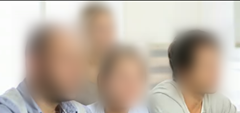
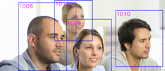

# Redact faces with Azure Media Analytics

[!INCLUDE [media services api v2 logo](./includes/v2-hr.md)]

## Overview

**Azure Media Redactor** is an [Azure Media Analytics](./legacy-components.md) media processor (MP) that offers scalable face redaction in the cloud. Face redaction enables you to modify your video in order to blur faces of selected individuals. You may want to use the face redaction service in public safety and news media scenarios. A few minutes of footage that contains multiple faces can take hours to redact manually, but with this service the face redaction process will require just a few simple steps.

This article gives details about **Azure Media Redactor** and shows how to use it with Media Services SDK for .NET.

## Face redaction modes

Facial redaction works by detecting faces in every frame of video and tracking the face object both forwards and backwards in time, so that the same individual can be blurred from other angles as well. The automated redaction process is complex and does not always produce 100% of desired output, for this reason Media Analytics provides you with a couple of ways to modify the final output.

In addition to a fully automatic mode, there is a two-pass workflow, which allows the selection/de-selection of found faces via a list of IDs. Also, to make arbitrary per frame adjustments the MP uses a metadata file in JSON format. This workflow is split into **Analyze** and **Redact** modes. You can combine the two modes in a single pass that runs both tasks in one job; this mode is called **Combined**.

   > [!NOTE]
   > Face Detector Media Processor has been deprecated as of June 2020, [Azure Media Services legacy components](./legacy-components.md). Consider using Azure Media Services v3 API. There is no planned replacement for the China region.

### Combined mode

This produces a redacted mp4 automatically without any manual input.

| Stage | File Name | Notes |
| --- | --- | --- |
| Input asset |foo.bar |Video in WMV, MOV, or MP4 format |
| Input config |Job configuration preset |{'version':'1.0', 'options': {'mode':'combined'}} |
| Output asset |foo_redacted.mp4 |Video with blurring applied |

### Analyze mode

The **analyze** pass of the two-pass workflow takes a video input and produces a JSON file of face locations, and jpg images of each detected face.

| Stage | File Name | Notes |
| --- | --- | --- |
| Input asset |foo.bar |Video in WMV, MPV, or MP4 format |
| Input config |Job configuration preset |{'version':'1.0', 'options': {'mode':'analyze'}} |
| Output asset |foo_annotations.json |Annotation data of face locations in JSON format. This can be edited by the user to modify the blurring bounding boxes. See sample below. |
| Output asset |foo_thumb%06d.jpg [foo_thumb000001.jpg, foo_thumb000002.jpg] |A cropped jpg of each detected face, where the number indicates the labelId of the face |

#### Output example

```json
{
  "version": 1,
  "timescale": 24000,
  "offset": 0,
  "framerate": 23.976,
  "width": 1280,
  "height": 720,
  "fragments": [
    {
      "start": 0,
      "duration": 48048,
      "interval": 1001,
      "events": [
        [],
        [],
        [],
        [],
        [],
        [],
        [],
        [],
        [],
        [],
        [],
        [],
        [],
        [
          {
            "index": 13,
            "id": 1138,
            "x": 0.29537,
            "y": -0.18987,
            "width": 0.36239,
            "height": 0.80335
          },
          {
            "index": 13,
            "id": 2028,
            "x": 0.60427,
            "y": 0.16098,
            "width": 0.26958,
            "height": 0.57943
          }
        ],

    ... truncated
```

### Redact mode

The second pass of the workflow takes a larger number of inputs that must be combined into a single asset.

This includes a list of IDs to blur, the original video, and the annotations JSON. This mode uses the annotations to apply blurring on the input video.

The output from the Analyze pass does not include the original video. The video needs to be uploaded into the input asset for the Redact mode task and selected as the primary file.

| Stage | File Name | Notes |
| --- | --- | --- |
| Input asset |foo.bar |Video in WMV, MPV, or MP4 format. Same video as in step 1. |
| Input asset |foo_annotations.json |annotations metadata file from phase one, with optional modifications. |
| Input asset |foo_IDList.txt (Optional) |Optional new line separated list of face IDs to redact. If left blank, this blurs all faces. |
| Input config |Job configuration preset |{'version':'1.0', 'options': {'mode':'redact'}} |
| Output asset |foo_redacted.mp4 |Video with blurring applied based on annotations |

#### Example output

This is the output from an IDList with one ID selected.

Example foo_IDList.txt

```
1
2
3
```

## Blur types

In the **Combined** or **Redact** mode, there are 5 different blur modes you can choose from via the JSON input configuration: **Low**, **Med**, **High**, **Box**, and **Black**. By default **Med** is used.

You can find samples of the blur types below.

### Example JSON

```json
{
    'version':'1.0',
    'options': {
        'Mode': 'Combined',
        'BlurType': 'High'
    }
}
```

#### Low


#### Med



#### High


#### Box



#### Black


## Elements of the output JSON file

The Redaction MP provides high precision face location detection and tracking that can detect up to 64 human faces in a video frame. Frontal faces provide the best results, while side faces and small faces (less than or equal to 24x24 pixels) are challenging.

[!INCLUDE [media-services-analytics-output-json](../latest/includes/media-services-analytics-output-json.md)]

