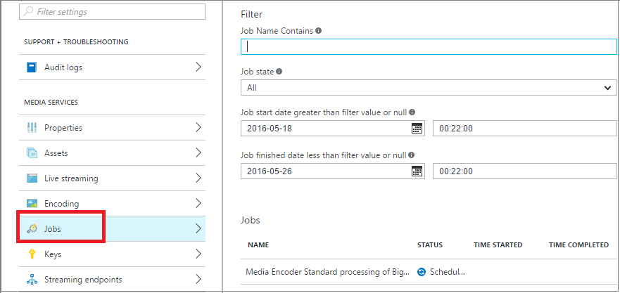
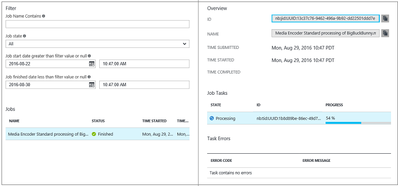

# Monitor encoding job progress with the Azure portal

[!INCLUDE [media services api v2 logo](./includes/v2-hr.md)]

[!INCLUDE [v2 deprecation notice](../latest/includes/v2-deprecation-notice.md)]

## Overview

When you run jobs, you often require a way to track job progress. 

To monitor the progress of the encoding job, click **Settings** (at the top of the page) and then select **Jobs**.

You can click the job to see more details.

